<div align="center">

# 🚦 AI/ML Internship Task 3: Traffic Sign Dataset & Recognition Studio

<p align="center">
  <b>A production-ready computer vision dataset & interactive web suite for real-time traffic sign classification</b>
</p>

<!-- Project Banner -->


<!-- Shields / Badges -->
<p align="center">
  <a href="https://vijaymahes9080.github.io/AI-ML-internship-task-3/" target="_blank">
    
  </a>
  <a href="https://github.com/vijaymahes9080/AI-ML-internship-task-3/actions/workflows/deploy.yml">
    
  </a>
  
  
</p>

[🌐 **Live Studio App**](https://vijaymahes9080.github.io/AI-ML-internship-task-3/) • [Explore Dataset](#-curated-dataset-gallery) • [Studio Web App](#-interactive-studio-suite) • [Installation & Usage](#-quick-start) • [Author & Contact](#-author)

---

</div>

## 🌟 Executive Summary

Welcome to the **Traffic Sign Recognition & Dataset Studio** developed for **AI/ML Internship Task 3**. This project delivers a high-accuracy, balanced multi-class computer vision dataset alongside an end-to-end interactive testing and dataset collection environment. 

Designed with modern machine learning principles, each class incorporates comprehensive real-world variations including **perspective skew, distance scaling, ambient lighting shifts, and tilt angles**.

---

## 📊 Dataset Distribution & Specifications

<div align="center">

| Class Sign | Class Identifier | Samples | Image Format | Primary Characteristics |
| :---: | :---: | :---: | :---: | :--- |
|  | **`stop`** | **35 images** | `.jpg` (RGB) | Octagonal red boundary, contrasting white typography, multi-perspective |
|  | **`left_turn`** | **35 images** | `.jpg` (RGB) | Blue circular / directional arrow indicators, leftward angle vector |
|  | **`right_turn`** | **35 images** | `.jpg` (RGB) | Emerald / green directional indicators, rightward orientation angle |

</div>

<br/>

### 🎯 Variation & Quality Control Matrix
To guarantee robust generalization across deep learning backbones (CNNs, MobileNet, ResNet):
- **Rotation & Angle:** Varied between -30° to +45° tilted camera captures.
- **Scale & Distance:** Close-up macro shots, mid-range framing, and distant horizon placements.
- **Lighting Conditions:** Bright direct daylight, ambient shadow, and soft interior diffusion.
- **Background Noise:** Urban background, natural clutter, clean backdrop, and screen glare reflections.

---

## 🖼️ Curated Dataset Gallery

Here is a visual inspection of real samples included directly in the repository:

### 🛑 Class 1: STOP Sign Samples (`stop/`)
<div align="center">
  <table>
    <tr>
      <td align="center">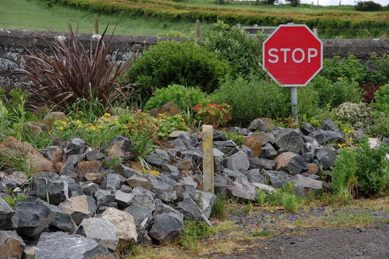<br/><b>stop_01.jpg</b><br/><sub>Direct Straight</sub></td>
      <td align="center">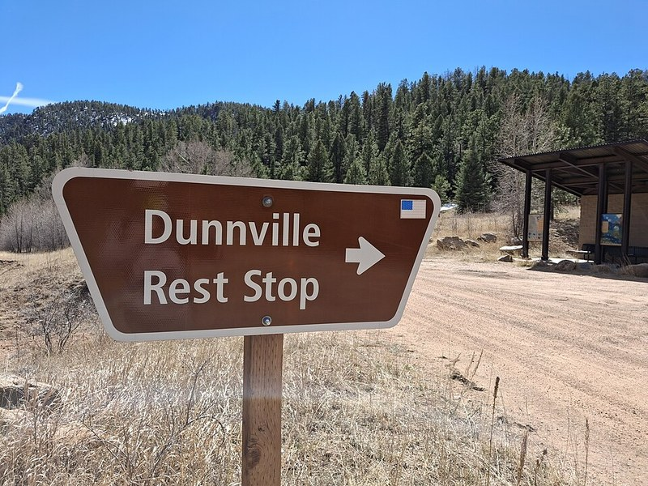<br/><b>stop_04.jpg</b><br/><sub>Tilted Angle</sub></td>
      <td align="center">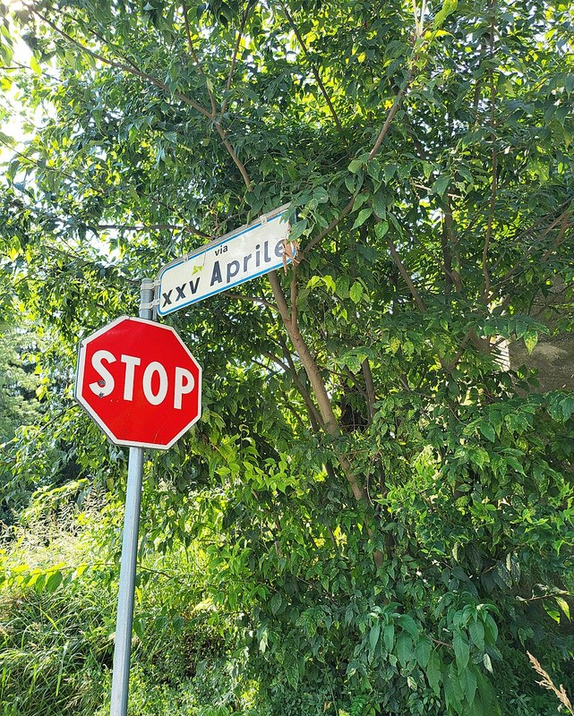<br/><b>stop_11.jpg</b><br/><sub>Close Perspective</sub></td>
      <td align="center">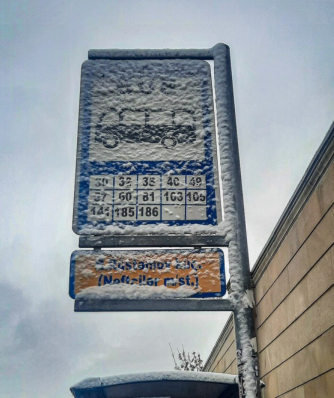<br/><b>stop_18.jpg</b><br/><sub>Ambient Lighting</sub></td>
      <td align="center">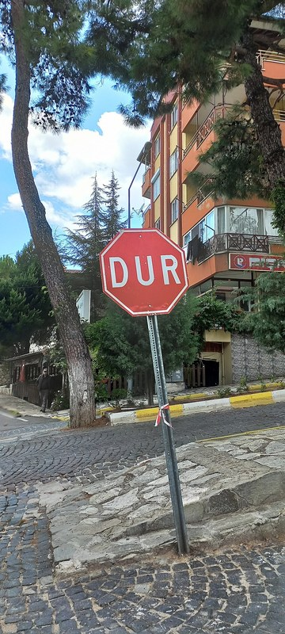<br/><b>stop_25.jpg</b><br/><sub>Far Range</sub></td>
    </tr>
  </table>
</div>

### ⬅️ Class 2: LEFT TURN Samples (`left_turn/`)
<div align="center">
  <table>
    <tr>
      <td align="center">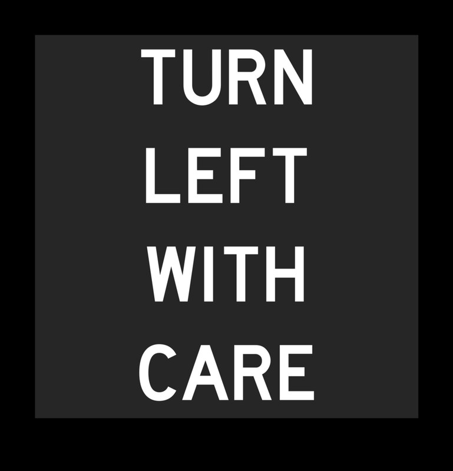<br/><b>left_turn_01.jpg</b><br/><sub>Standard Focus</sub></td>
      <td align="center">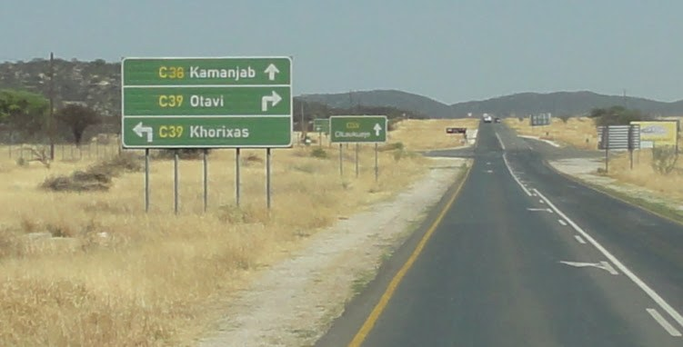<br/><b>left_turn_06.jpg</b><br/><sub>Dynamic Rotation</sub></td>
      <td align="center">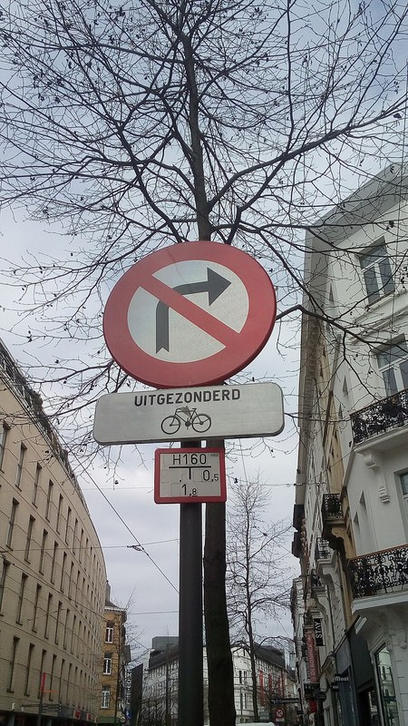<br/><b>left_turn_13.jpg</b><br/><sub>Perspective Offset</sub></td>
      <td align="center"><br/><b>left_turn_20.jpg</b><br/><sub>High Contrast</sub></td>
      <td align="center">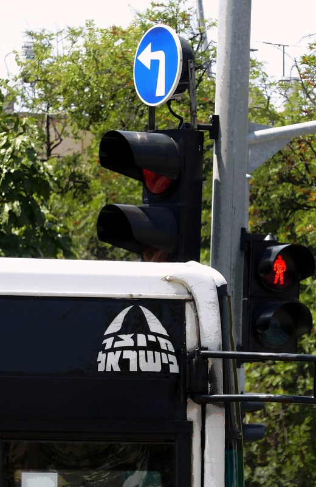<br/><b>left_turn_29.jpg</b><br/><sub>Real-world Shadow</sub></td>
    </tr>
  </table>
</div>

### ➡️ Class 3: RIGHT TURN Samples (`right_turn/`)
<div align="center">
  <table>
    <tr>
      <td align="center"><br/><b>right_turn_01.jpg</b><br/><sub>Direct Alignment</sub></td>
      <td align="center">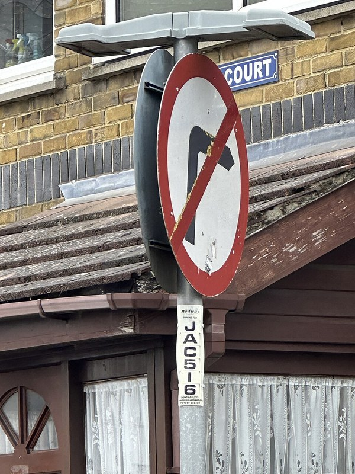<br/><b>right_turn_07.jpg</b><br/><sub>Angled Viewpoint</sub></td>
      <td align="center">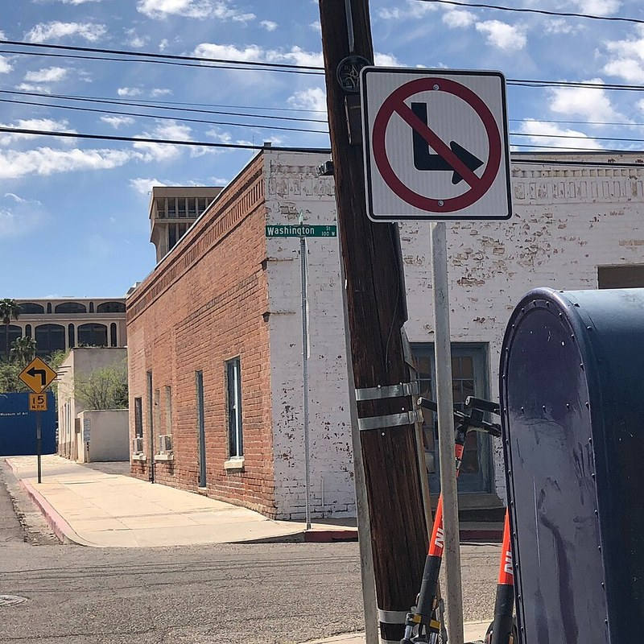<br/><b>right_turn_15.jpg</b><br/><sub>Variable Distance</sub></td>
      <td align="center">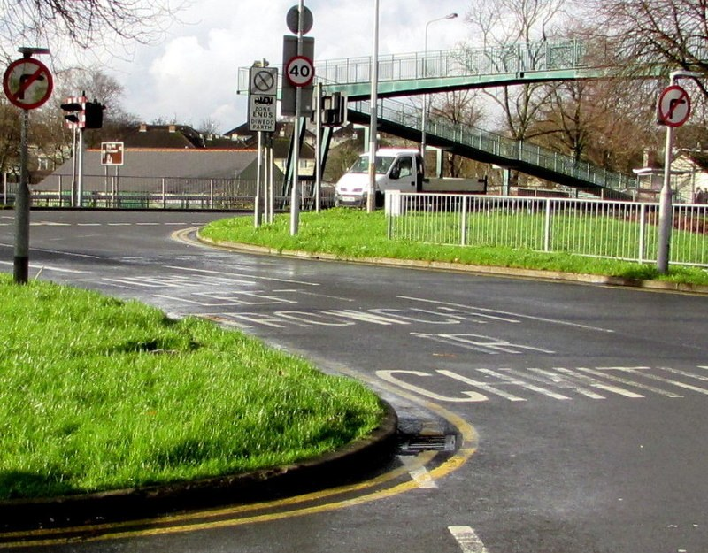<br/><b>right_turn_21.jpg</b><br/><sub>Soft Illumination</sub></td>
      <td align="center">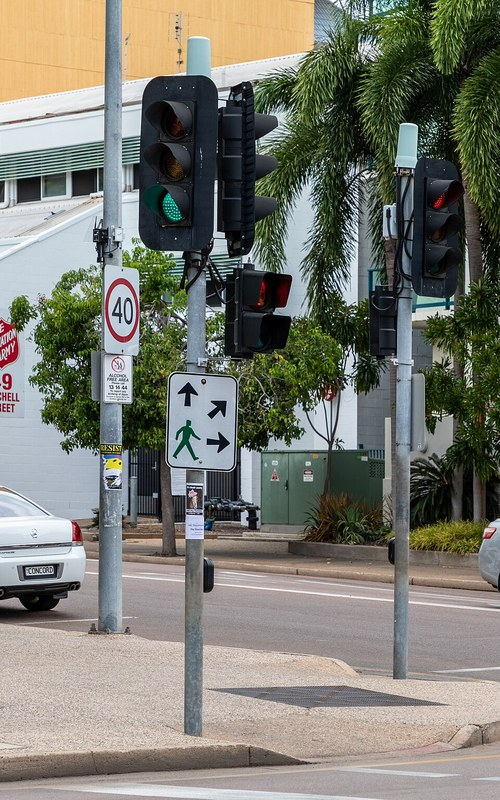<br/><b>right_turn_30.jpg</b><br/><sub>Boundary Precision</sub></td>
    </tr>
  </table>
</div>

---

## 💻 Interactive Studio Suite (`vj_traffic_studio.html`)

The repository includes a web suite built for data inspection, real-time webcam data collection, and model validation.

```
       ┌─────────────────────────────────────────────────────────────┐
       │                 VJ TRAFFIC STUDIO SUITE                     │
       └──────────────────────────────┬──────────────────────────────┘
                                      │
         ┌────────────────────────────┼────────────────────────────┐
         ▼                            ▼                            ▼
┌──────────────────┐        ┌──────────────────┐        ┌──────────────────┐
│  DATASET GALLERY │        │  WEBCAM STUDIO   │        │ DISPLAY & PRINT  │
│  Instant preview │        │  5x Burst Mode   │        │ High-contrast    │
│  of 105 images   │        │  Variation Guide │        │ testing sheets   │
└──────────────────┘        └──────────────────┘        └──────────────────┘
```

### Module Highlights:
1. **Integrated Dataset Gallery**: Real-time thumbnail preview for all 3 classes with live counter metrics.
2. **Camera Studio & Burst Capture**:
   - Single-frame snapshot and **5x burst capture** modes.
   - Built-in guidance checklist (Center, 45° tilt, close-up, distance, rotation).
   - One-click batch download of acquired `.jpg` frames.
3. **Digital Target Display**: Instant full-screen vector rendition of traffic signs to test models against mobile or external monitor screens.
4. **Print-Ready Cutout Mode**: Built-in stylesheet configured for standard A4 printing to produce physical testing cards for webcams.

---

## 🗂️ Project Architecture

```plaintext
AI-ML-internship-task-3/
├── 📁 left_turn/                 # 35 Left Turn sign images (JPG)
├── 📁 right_turn/                # 35 Right Turn sign images (JPG)
├── 📁 stop/                      # 35 Stop sign images (JPG)
├── 📦 converted_keras.zip        # Pre-trained Keras model weights & metadata
├── 🌐 vj_traffic_studio.html     # Interactive Web Studio & Dataset Inspector
├── 📄 Task 3 VJ.docx             # Formal Internship Report & Documentation
├── 🖼️ image.png                  # Project Showcase & Banner Graphic
├── 📝 linkedin.md                # Ready-to-publish LinkedIn Project Article
├── ⚙️ composer.json              # Project developer metadata
├── 🛡️ LICENSE                   # Open-source MIT License
└── 📖 README.md                  # Master documentation (you are here)
```

---

## ⚡ Quick Start

### 1. Access the Live Web App (No Installation Needed!)
Instant interactive deployment on GitHub Pages:
👉 **[Launch Traffic Sign Studio Online](https://vijaymahes9080.github.io/AI-ML-internship-task-3/)**

### 2. Run Locally / Clone the Repository
```bash
git clone https://github.com/vijaymahes9080/AI-ML-internship-task-3.git
cd AI-ML-internship-task-3
```

Open `index.html` (or `vj_traffic_studio.html`) directly in any web browser:
```powershell
# Windows PowerShell
Start-Process .\index.html
```
*(Or simply double-click `index.html`)*

### 3. Load Dataset with Python (TensorFlow / PyTorch)
```python
import tensorflow as tf

# Load the dataset directly from directory structure
dataset = tf.keras.utils.image_dataset_from_directory(
    directory=".",
    labels="inferred",
    label_mode="categorical",
    image_size=(224, 224),
    batch_size=16,
    subset="both",
    validation_split=0.2,
    seed=42
)
train_ds, val_ds = dataset
print(f"Loaded classes: {train_ds.class_names}")
```

---

## 👨‍💻 Author

<table style="border: none;">
  <tr>
    <td width="90" align="center">
      
    </td>
    <td>
      <h3 style="margin: 0;">Vijay Mahes</h3>
      <p style="margin: 4px 0; color: #4b5563;">AI & Machine Learning Intern</p>
      <a href="mailto:Vijaypradhap2004@gmail.com"></a>
      <a href="https://github.com/vijaymahes9080"></a>
      <a href="https://github.com/vijaymahes9080/AI-ML-internship-task-3"></a>
    </td>
  </tr>
</table>

---

## 📄 License

This repository is licensed under the [MIT License](LICENSE). Feel free to use and adapt it for academic, research, and commercial applications.
